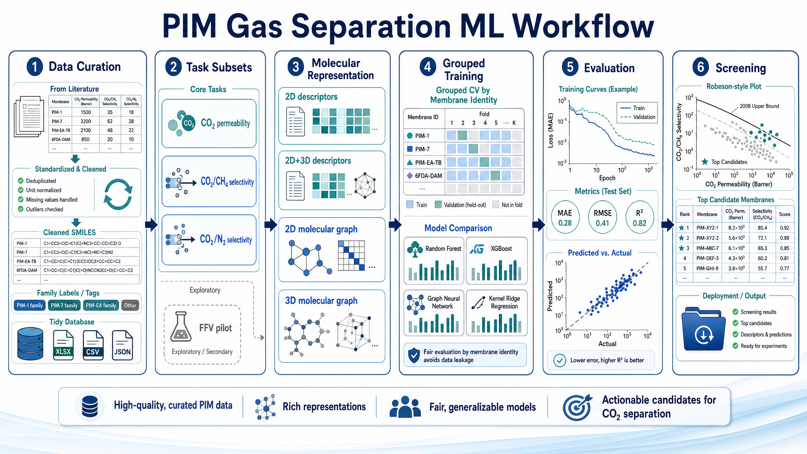
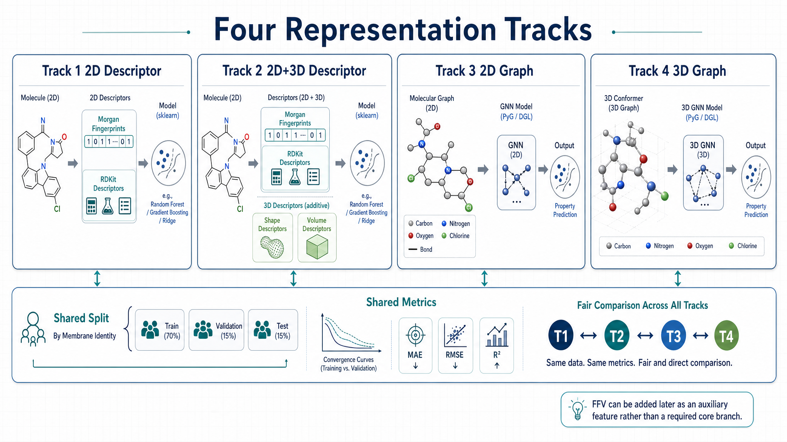

# PIM 气体分离机器学习项目说明

英文版见 [README.md](C:/Users/16976/Desktop/smile_FFV/README.md)。

## 项目定位

这个仓库服务于当前项目主线：

`SMILES/graph + aging (+ optional thickness) -> CO2-centered property prediction (permeability + pair targets) -> Robeson-style screening`

也就是说，我们当前要解决的不是完整的逆向设计，也不是全气体统一建模，而是先搭建一条与现有清洗数据相匹配、可复现、可比较的 `CO2` 中心建模流程。

当前仓库已经覆盖：

- `CO2` 渗透率分组建模
- `CO2/CH4` 与 `CO2/N2` 的 pair-specific 任务
- Robeson 风格筛选与图表导出
- 四档结构表示对比
- `oracle_ffv` 上界实验
- 独立的外部 `FFV` 双轨预训练工作区 `ffv_pretrain/`

## 工作流概览



## 四档表示方式



当前主任务默认按四档路线比较：

1. `descriptor_2d`
2. `descriptor_2d_3d`
3. `graph_2d`
4. `graph_3d`

其中：

- `descriptor_2d`：二维指纹/描述符 + sklearn 回归器
- `descriptor_2d_3d`：二维特征基础上再加入三维数值描述符
- `graph_2d`：无坐标分子图 + 图神经网络
- `graph_3d`：带原子坐标的分子图 + 距离感知图神经网络

## 先看哪些文件

建议先按下面顺序阅读：

- [task.md](C:/Users/16976/Desktop/smile_FFV/task.md) 和 [task_zh.md](C:/Users/16976/Desktop/smile_FFV/task_zh.md)：当前任务定义
- [polymer_pim_gas_separation_pipeline.md](C:/Users/16976/Desktop/smile_FFV/polymer_pim_gas_separation_pipeline.md)：研究总方案
- [docs/00_workflow_overview.md](C:/Users/16976/Desktop/smile_FFV/docs/00_workflow_overview.md)：整体流程文档
- [docs/13_graph_training_backend.md](C:/Users/16976/Desktop/smile_FFV/docs/13_graph_training_backend.md)：图模型训练说明
- [docs/15_external_ffv_pretraining.md](C:/Users/16976/Desktop/smile_FFV/docs/15_external_ffv_pretraining.md)：外部 FFV 预训练方案
- [docs/16_external_ffv_dual_track_addendum.md](C:/Users/16976/Desktop/smile_FFV/docs/16_external_ffv_dual_track_addendum.md)：2D/3D 双轨 FFV 预训练补充说明
- [ffv_pretrain/README_zh.md](C:/Users/16976/Desktop/smile_FFV/ffv_pretrain/README_zh.md)：独立 FFV 预训练工作区使用说明

## 仓库结构

```text
smile_FFV/
|-- configs/
|   |-- co2_grouped_descriptor_2d.yaml
|   |-- co2_grouped_descriptor_2d_3d.yaml
|   |-- co2_grouped_graph_2d.yaml
|   |-- co2_grouped_graph_3d.yaml
|   |-- co2_grouped_oracle_ffv.yaml
|   |-- co2_grouped_descriptor_2d_predffv_2d.yaml
|   |-- co2_grouped_descriptor_2d_predffv_3d.yaml
|   |-- co2_grouped_graph_2d_predffv_2d.yaml
|   |-- co2_grouped_graph_3d_predffv_3d.yaml
|   |-- co2_ch4_*.yaml
|   |-- co2_n2_*.yaml
|   `-- ffv_pilot.yaml
|-- docs/
|-- ffv_pretrain/
|   |-- configs/
|   |-- ffv_pretrain/
|   |-- requirements/
|   |-- scripts/
|   |-- environment.yml
|   `-- README_zh.md
|-- output/
|   |-- cleaned_data/
|   `-- experiments/
|-- pim_ml/
|   |-- methods/
|   |   |-- descriptor_2d/
|   |   |-- descriptor_2d_3d/
|   |   |-- graph_2d/
|   |   `-- graph_3d/
|   |-- reporting.py
|   |-- splits.py
|   |-- train_baseline.py
|   `-- train_graph.py
|-- requirements/
|-- scripts/
|-- task.md
|-- task_zh.md
|-- README.md
|-- README_zh.md
|-- environment.yml
`-- pyproject.toml
```

## 环境安装

### 推荐方式：conda

```bash
conda env create -f environment.yml
conda activate pim-gas-ml
```

推荐使用 conda 的原因是 `rdkit` 安装更稳定。

### 可选方式：venv + pip

```bash
python -m venv .venv
source .venv/bin/activate
pip install -r requirements/server.txt
pip install -e .
```

如果要跑图模型，再额外安装：

```bash
pip install -r requirements/graph.txt
```

## 安装本地命令

```bash
pip install -e .
```

安装后可以直接使用：

```bash
pim-train-baseline --config configs/co2_grouped_baseline.yaml
```

## 对不熟悉代码的使用者：最短上手路径

1. 先选一个 `configs/*.yaml`
2. 运行一条训练命令
3. 打开对应的 `output/experiments/<run_name>/`
4. 先看 `summary_metrics.csv`、`predictions.csv`、`plots/*.png`

例如：

```bash
python scripts/train_baseline.py --config configs/co2_grouped_descriptor_2d.yaml
```

## 方法切换方式

### 方式 1：直接换配置文件

这是最推荐的方式。

`CO2 grouped`：

- `configs/co2_grouped_descriptor_2d.yaml`
- `configs/co2_grouped_descriptor_2d_3d.yaml`
- `configs/co2_grouped_graph_2d.yaml`
- `configs/co2_grouped_graph_3d.yaml`

`CO2/CH4`：

- `configs/co2_ch4_descriptor_2d.yaml`
- `configs/co2_ch4_descriptor_2d_3d.yaml`
- `configs/co2_ch4_graph_2d.yaml`
- `configs/co2_ch4_graph_3d.yaml`

`CO2/N2`：

- `configs/co2_n2_descriptor_2d.yaml`
- `configs/co2_n2_descriptor_2d_3d.yaml`
- `configs/co2_n2_graph_2d.yaml`
- `configs/co2_n2_graph_3d.yaml`

### 方式 2：命令行覆盖 `method`

```bash
python scripts/train_baseline.py --config configs/co2_grouped_descriptor_2d.yaml --method descriptor_2d_3d
```

### 方式 3：修改仓库默认回退方法

文件：

- [pim_ml/methods/__init__.py](C:/Users/16976/Desktop/smile_FFV/pim_ml/methods/__init__.py)

当前默认回退值是：

```python
DEFAULT_METHOD_NAME = "descriptor_2d_3d"
```

只有当某个配置文件没有显式写 `representation.method` 时，这个默认值才会生效。  
由于当前仓库的大多数正式配置都已经显式写明方法，因此这种方式最不推荐。

### 查看当前可用方法

```bash
pim-train-baseline --list-methods
```

## 快速开始

### 1. 运行 `CO2 grouped` 基线

```bash
python scripts/train_baseline.py --config configs/co2_grouped_baseline.yaml
```

### 2. 运行 `CO2/CH4` 筛选任务

```bash
python scripts/train_baseline.py --config configs/co2_ch4_screening.yaml
```

### 3. 运行 `CO2/N2` 筛选任务

```bash
python scripts/train_baseline.py --config configs/co2_n2_screening.yaml
```

### 4. 运行 `FFV` 小样本 pilot

```bash
python scripts/train_baseline.py --config configs/ffv_pilot.yaml
```

### 5. 运行 `oracle_ffv` 上界实验

```bash
python scripts/train_baseline.py --config configs/co2_grouped_oracle_ffv.yaml
python scripts/train_baseline.py --config configs/co2_ch4_oracle_ffv.yaml
python scripts/train_baseline.py --config configs/co2_n2_oracle_ffv.yaml
```

## predicted FFV 下游配置怎么用

仓库现在已经为三类主任务分别写好了 `predffv_2d` 和 `predffv_3d` 配置。

命名规则是：

- `*_predffv_2d.yaml`：下游使用 2D 外部 FFV 预训练模型补出的 `predicted_ffv`
- `*_predffv_3d.yaml`：下游使用 3D 外部 FFV 预训练模型补出的 `predicted_ffv`

例如：

- `configs/co2_grouped_descriptor_2d_predffv_2d.yaml`
- `configs/co2_grouped_descriptor_2d_predffv_3d.yaml`
- `configs/co2_ch4_graph_2d_predffv_2d.yaml`
- `configs/co2_n2_graph_3d_predffv_3d.yaml`

这些配置依赖于 `ffv_pretrain/output/augmented/` 里的回填 CSV，所以必须先完成外部 FFV 预测回填，再运行下游训练。

## 当前训练脚本做了什么

每次运行一个配置时，脚本会：

1. 读取清洗后的 CSV
2. 根据 `representation.method` 构建表格特征或图数据
3. 加入 `aging_days`、可选 `thickness_um`、以及配置中声明的额外数值特征
4. 按配置执行 `GroupKFold`、`LOO` 或 `KFold`
5. 训练对应模型
6. 输出指标、预测表、图表和最终模型
7. 如果开启 screening，则额外输出 Robeson 图与候选排序

控制台现在会显示：

- 总训练进度条
- 每折完成日志
- 训练集与验证集指标
- 最终模型排序

## 输出结果在哪里

主任务结果默认写入：

- [output/experiments](C:/Users/16976/Desktop/smile_FFV/output/experiments)

每个实验目录通常包含：

- `resolved_config.yaml`
- `train.log`
- `dataset_summary.json`
- `feature_manifest.csv`
- `split_manifest.csv`
- `predictions.csv`
- `fold_metrics.csv`
- `summary_metrics.csv`
- `convergence_summary.csv`
- `models/*.joblib`
- `models/*.pt`
- `plots/*.png`
- `convergence/*.csv`

如果是 screening 任务，还会额外生成：

- `screening_predictions.csv`
- `best_model_screening.csv`
- `robeson_upper_bounds.json`
- `plots/*_robeson.png`

## 最终模型参数保存在哪里

表格模型会保存到：

- `output/experiments/<run_name>/models/*.joblib`

图模型会保存到：

- `output/experiments/<run_name>/models/*.pt`

主任务训练在交叉验证结束后，会自动用全量数据再拟合一次，并保存这个 full-data refit 模型。

## FFV 相关实验的三层含义

### baseline

- 输入：`SMILES + aging (+ optional thickness)`
- 作用：当前主线参考

### oracle_ffv

- 输入：baseline + 真实 `ffv`
- 作用：估计如果 FFV 被完美知道，下游最多能提升多少
- 注意：只能作为上界实验，不能作为可部署流程结论

### stacked_ffv

现在建议拆成两条：

1. `stacked_ffv_2d`
2. `stacked_ffv_3d`

也就是分别比较：

- `baseline + predicted_ffv_from_graph_2d`
- `baseline + predicted_ffv_from_graph_3d`

推荐比较梯度为：

1. `baseline`
2. `stacked_ffv_2d`
3. `stacked_ffv_3d`
4. `oracle_ffv`

## 外部 FFV 预训练入口

外部大规模 `FFV` 预训练位于：

- [ffv_pretrain](C:/Users/16976/Desktop/smile_FFV/ffv_pretrain)

当前支持两条路线：

1. `graph_2d`
2. `graph_3d`

更详细说明见：

- [ffv_pretrain/README_zh.md](C:/Users/16976/Desktop/smile_FFV/ffv_pretrain/README_zh.md)

## 主要限制

- family 列目前仍不完整，因此 family-aware split 还不是默认路径
- 图模型已经可运行，但当前仍是第一版基础实现，结论必须结合小样本风险解读
- `oracle_ffv` 只在 FFV 重叠子集上运行，应视为上界/敏感性分析
- `predffv_2d` 与 `predffv_3d` 下游配置已就位，但其实际效果仍取决于上游外部 FFV 预训练质量

## 当前最推荐的推进顺序

1. 先稳定四档主任务结果
2. 比较 `descriptor_2d`、`descriptor_2d_3d`、`graph_2d`、`graph_3d`
3. 完成外部 FFV 的 2D/3D 双轨预训练
4. 生成回填后的 `predicted_ffv` 数据表
5. 比较 `baseline`、`stacked_ffv_2d`、`stacked_ffv_3d`、`oracle_ffv`
