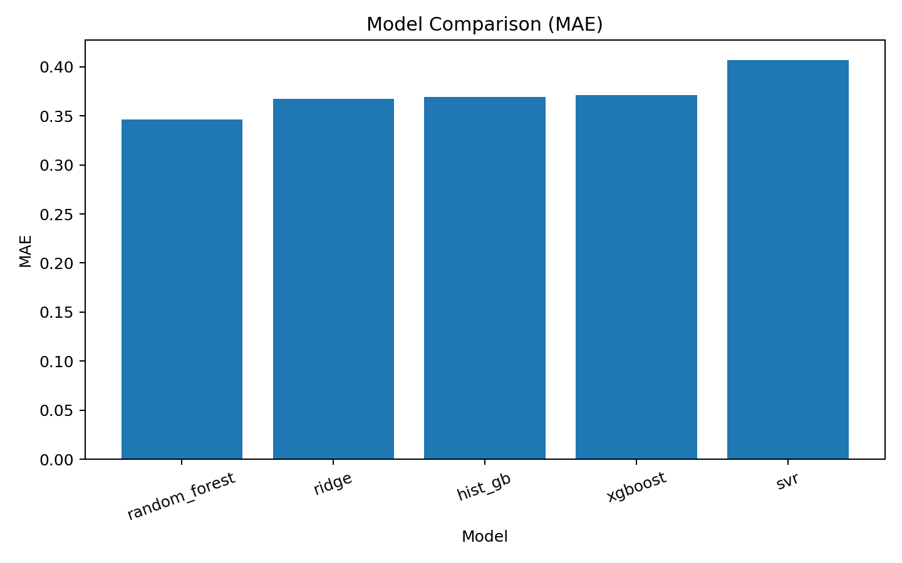

# 输出文件与结果解读

这份文档回答三个问题：

1. 每次训练结束后结果会写到哪里
2. 每个输出文件分别代表什么
3. 应该怎样解读图表、指标和筛选结果

## 1. 单次 run 的目录结构

训练完成后，结果通常写入：

- `output/experiments/<task>/<timestamp>/`

常见子目录和文件包括：

- `plots/`
- `models/`
- `convergence/`
- `resolved_config.yaml`
- `train.log`
- `dataset_summary.json`
- `feature_manifest.csv`
- `split_manifest.csv`
- `predictions.csv`
- `fold_metrics.csv`
- `summary_metrics.csv`
- `convergence_summary.csv`

## 2. 先看哪些文件

建议按下面顺序查看：

1. `summary_metrics.csv`
2. `fold_metrics.csv`
3. `predictions.csv`
4. `plots/model_comparison_mae.png`
5. `plots/*_parity.png`
6. `plots/*_residuals.png`
7. `plots/*_convergence.png`
8. 若是 screening 任务，再看 `best_model_screening.csv` 和 `plots/*_robeson.png`

## 3. 核心表格文件如何理解

### 3.1 配置与日志

- `resolved_config.yaml`
  - 记录本次实际运行时的完整配置快照
- `train.log`
  - 记录模型排名、训练摘要、screening 摘要等文字信息

### 3.2 数据与切分

- `dataset_summary.json`
  - 记录数据路径、样本量、表示方式、特征维度、过滤记录等
- `feature_manifest.csv`
  - 说明每个特征属于哪个 block
- `split_manifest.csv`
  - 记录每个 fold 的样本划分，用于检查 grouped split 是否符合预期

### 3.3 指标与预测

- `predictions.csv`
  - 保存逐样本预测结果，通常包含 `y_true`、`y_pred`、`residual`
- `fold_metrics.csv`
  - 保存逐 fold 的训练集和验证集指标
- `summary_metrics.csv`
  - 保存模型级汇总结果，通常最适合快速定位当前 best model
- `convergence_summary.csv`
  - 汇总各模型是否存在有效的迭代 loss 记录

### 3.4 模型参数文件

- 表格方法保存为 `models/*.joblib`
- 图方法保存为 `models/*.pt`

注意：

- 保存的是“全体样本重训后的最终模型”
- 不是某一个 fold 的中间模型

## 4. 图表应该怎么看

### 4.1 模型对比图 `model_comparison_mae.png`

这张图最适合第一眼看“哪一个模型当前最好”。

读法：

- 柱子越低越好
- 它只反映当前指标，例如这里是 `MAE`
- 如果多个模型很接近，不能只凭这一张图下结论，还要结合 `RMSE`、`R2` 和 fold 稳定性

### 4.2 一致性图 `*_parity.png`

这张图看“预测值和真实值是否接近对角线”。

读法：

- 点越贴近对角线，说明预测越准
- 如果整体集中在某个窄区间，说明模型可能学会了“往均值回归”
- 如果高值和低值都被压向中间，通常意味着 `R2` 会偏低

### 4.3 残差图 `*_residuals.png`

这张图看“误差是否有系统性偏差”。

读法：

- 理想情况是残差围绕 0 随机分布
- 如果左侧多为正、右侧多为负，说明模型在低值区和高值区存在系统性偏差
- 当前这张图能看到明显的斜向趋势，说明模型仍有结构性误差，不是纯随机噪声

### 4.4 收敛图 `*_convergence.png`

如果模型是迭代训练的，就会生成收敛图。

重点看：

- 训练 loss 是否稳定下降
- 验证 loss 是否同步下降
- 是否很早出现“训练继续变好，但验证开始变差”的过拟合信号

### 4.5 Robeson 风格图 `*_robeson.png`

这类图用于把渗透率与选择性放到同一张图上看筛选价值。

读法：

- 横轴通常是 `log10 CO2 permeability`
- 纵轴通常是某个 pair 的 `log10 selectivity`
- 点越靠近或越超过上界线，通常越有潜在应用价值
- “真实点”和“预测点”之间如果偏差很大，说明模型虽然能给排序线索，但还不足以支持强结论

## 5. 指标怎么联合解读

### 5.1 `MAE`

- 平均绝对误差
- 越小越好
- 最直观，表示模型平均会偏离真实值多少

### 5.2 `RMSE`

- 均方根误差
- 越小越好
- 对大误差样本惩罚更重，适合判断是否存在少数“翻车点”

### 5.3 `R2`

- 决定系数
- 越接近 `1` 越好
- `R2 = 0` 表示和“直接预测均值”差不多
- `R2 < 0` 表示比“直接猜平均值”还差

### 5.4 实际判断逻辑

- `MAE` 低但 `R2` 低：模型平均误差不离谱，但区分高低样本的能力仍弱
- `RMSE` 明显高于 `MAE`：存在少数误差很大的难样本
- `R2` 提升而 `MAE` 变化不大：说明模型排序能力可能在变好

## 6. screening 输出怎么看

如果配置开启了 screening，还会生成：

- `screening_predictions.csv`
- `best_model_screening.csv`
- `robeson_upper_bounds.json`
- `{model_name}_screening.csv`
- `plots/{model_name}_robeson.png`

其中最重要的是：

- `best_model_screening.csv`
  - 适合直接看候选材料排序
- `{model_name}_screening.csv`
  - 能细看每个模型的真实/预测选择性、相对上界距离和排名分数

## 7. 当前项目中最推荐的读图口径

在这个项目里，不建议只盯某一个指标或某一张图。

更稳妥的顺序是：

1. 先用 `summary_metrics.csv` 看谁是当前 best model
2. 再用 `parity` 和 `residuals` 判断这个 best 是否真的可靠
3. 如果是 screening 任务，再看 `robeson` 图判断它是否有筛选解释力
4. 如果是迭代模型，再看 `convergence` 判断训练是否真的收敛

这套顺序能帮助你区分：

- “数值上暂时最好”
- 和
- “真的值得用于研究结论”
