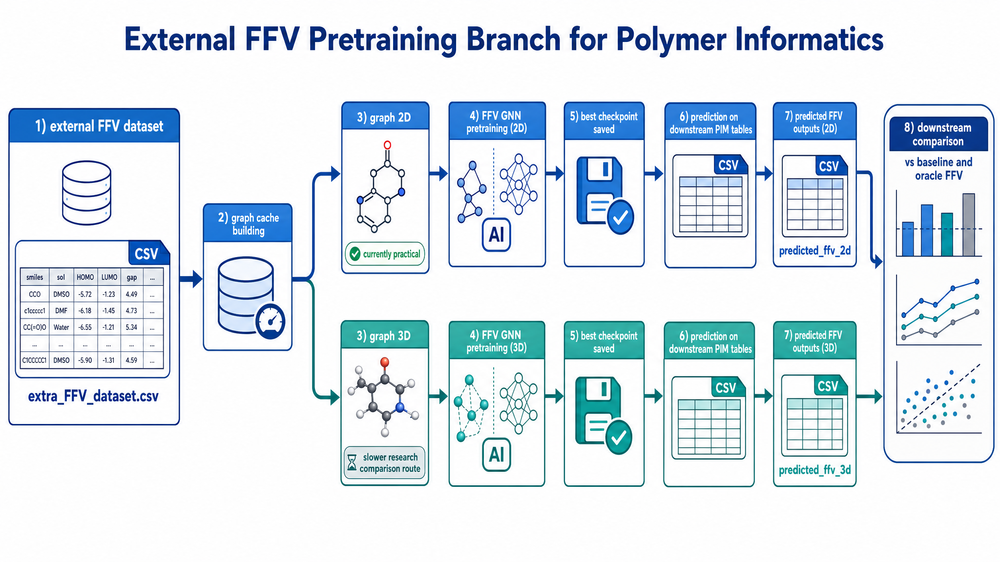

# 外部 FFV 双轨预训练方案

## 1. 方案定位

当前内部 `FFV` 数据量太小，不能继续把 `ffv_pilot_subset.csv` 视为主线前置模块。  
因此，这条支线的真实目标是：

`extra_FFV_dataset.csv -> 外部 FFV 预训练 -> predicted_ffv -> 下游 CO2 / CO2-CH4 / CO2-N2 对比`

它的角色是：

- 提供可扩展的上游 `FFV` 代理特征来源
- 支持 `baseline`、`predffv_2d`、`predffv_3d`、`oracle_ffv` 的系统比较
- 为主任务提供“辅助特征是否有价值”的证据，而不是替代主任务本身

需要注意的是，当前项目并不只有这一条 FFV 路线。  
如果你要看“通过分子模拟直接计算 FFV”的真实步骤，请同时参考：

- [docs/18_ffv_simulation_workflow.md](C:/Users/16976/Desktop/smile_FFV/docs/18_ffv_simulation_workflow.md)
- [get_FFV/example/README.md](C:/Users/16976/Desktop/smile_FFV/get_FFV/example/README.md)

## 2. 支线流程图

## 2.1 预训练模型本体长什么样

如果你需要解释“FFV 预训练时模型内部到底在做什么”，可以直接看下面这张图：

更完整的逐模型架构说明见：

- [docs/19_model_architecture_gallery.md](C:/Users/16976/Desktop/smile_FFV/docs/19_model_architecture_gallery.md)

## 3. 为什么要同时保留 2D 和 3D

如果只做一条外部 FFV 预训练路线，即使下游有提升，也很难判断提升到底来自：

- 图表示本身
- 3D 空间信息
- 还是随机训练波动

因此，外部 FFV 预训练也保持双轨结构：

1. `graph_2d`
2. `graph_3d`

这样和主任务的四档表示对比逻辑更一致。

## 4. 当前代码对应关系

独立工作区位于：

- [ffv_pretrain](C:/Users/16976/Desktop/smile_FFV/ffv_pretrain)

其中已经支持：

- 构图缓存
- FFV GNN 训练
- 最优 checkpoint 保存
- 对主任务 CSV 做 FFV 回填

相关脚本：

- `ffv_pretrain/scripts/build_graph_cache.py`
- `ffv_pretrain/scripts/train_external_ffv_gnn.py`
- `ffv_pretrain/scripts/predict_external_ffv_gnn.py`

## 5. 当前进展与真实状态

### 5.1 已经确认可行的部分

- `graph_2d` 外部 FFV 预训练已经跑通
- 上游测试结果显示该路线本身具备较好的 `SMILES -> FFV` 学习能力
- `predffv_2d` 增强表已经成功生成并接入下游对比实验

代表性上游图像可以参考小样本 `FFV pilot` 的一致性示例：

注意：

- 这张图来自内部小样本 `ffv_pilot`，不是外部大样本训练本身
- 它主要用于展示当前仓库里 FFV 相关图表的样式与读法

### 5.2 目前不作为默认路径的部分

- `graph_3d` 全量外部 FFV cache 构建仍然过慢
- 因为需要逐条做 RDKit 3D 构象生成或 2D 回退
- 所以这条线当前保留为研究对照，不作为默认执行步骤

## 6. 推荐执行顺序

建议按下面顺序推进：

1. 建 `graph_2d` cache
2. 训练 `graph_2d` FFV 预训练模型
3. 生成 `predicted_ffv_2d` 增强 CSV
4. 在主任务中运行 `*_predffv_2d.yaml`
5. 再视资源情况尝试 `graph_3d` cache 与 `predffv_3d`

## 7. 与主任务的关系

这条支线不替代主项目主线。

主线仍然是：

- 清洗数据
- 四档表示对比
- grouped split
- 下游 CO2 与 pair-specific 建模

FFV 支线只是额外回答两个问题：

1. 外部大样本能否稳定学到 `SMILES -> FFV`
2. 学到的 `predicted_ffv` 能否对下游任务提供增益

## 8. 当前最合理的研究口径

到目前为止，更合理的表述是：

- 外部 FFV 预训练在上游任务上是成功的
- 但 `predicted_ffv` 在下游任务中的收益具有明显的任务依赖性
- 因此 FFV 当前更适合作为辅助特征研究对象，而不是默认主线前置模块

## 9. 后续最值得做的事情

1. 完成 `graph_3d` 外部 FFV 预训练的抽样验证
2. 比较 `predffv_2d` 与 `predffv_3d` 的下游贡献差异
3. 检查 `predicted_ffv` 与现有描述符之间的信息重叠程度
4. 优先分析在哪些任务、哪些模型上 FFV 真正有帮助
