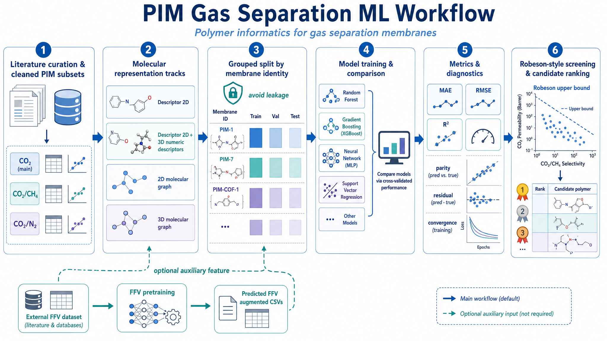
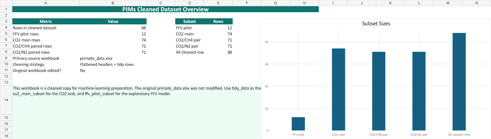
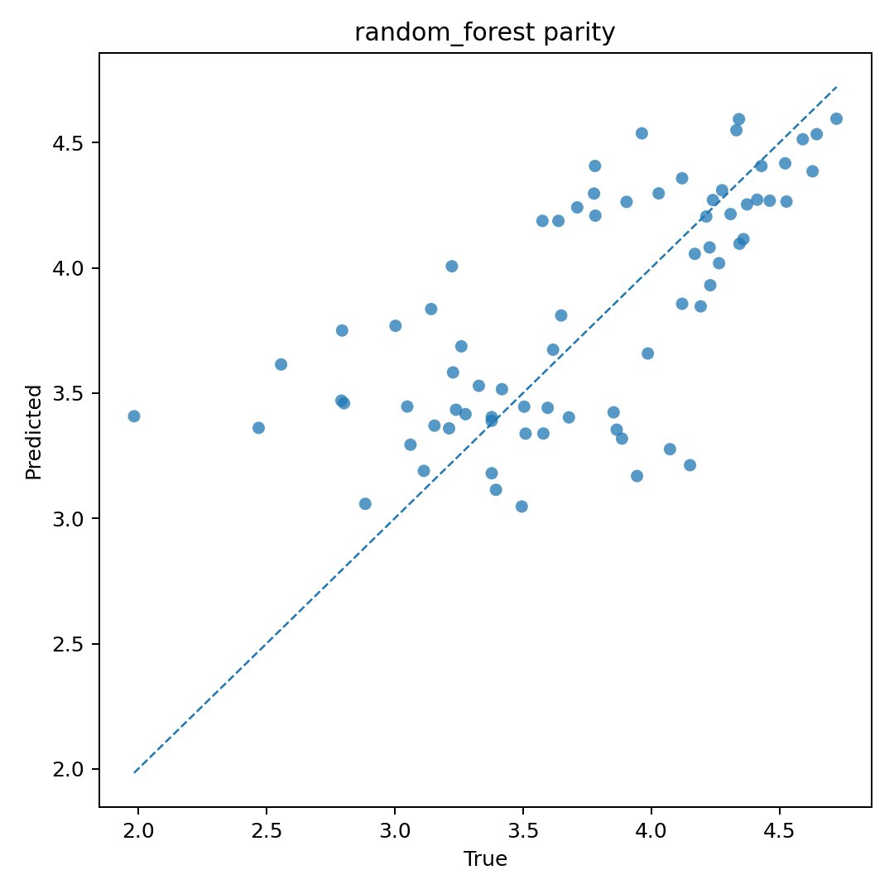
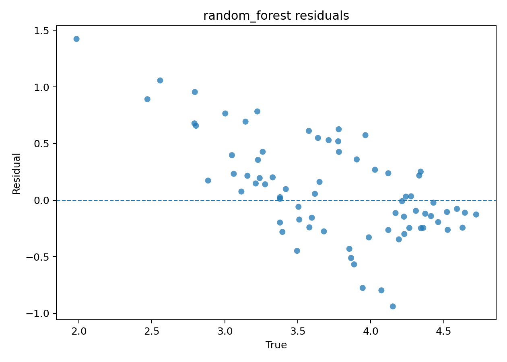
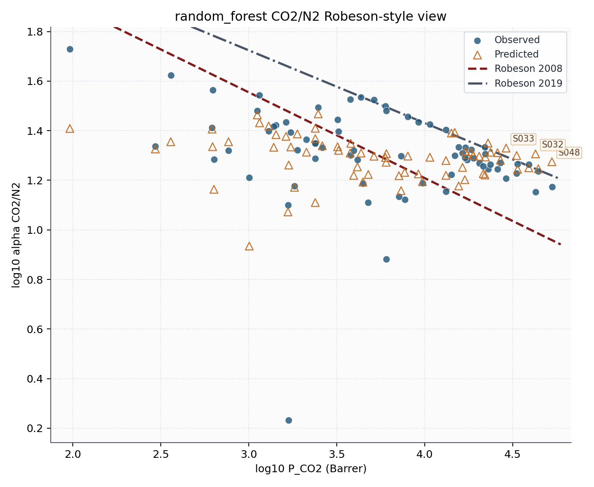
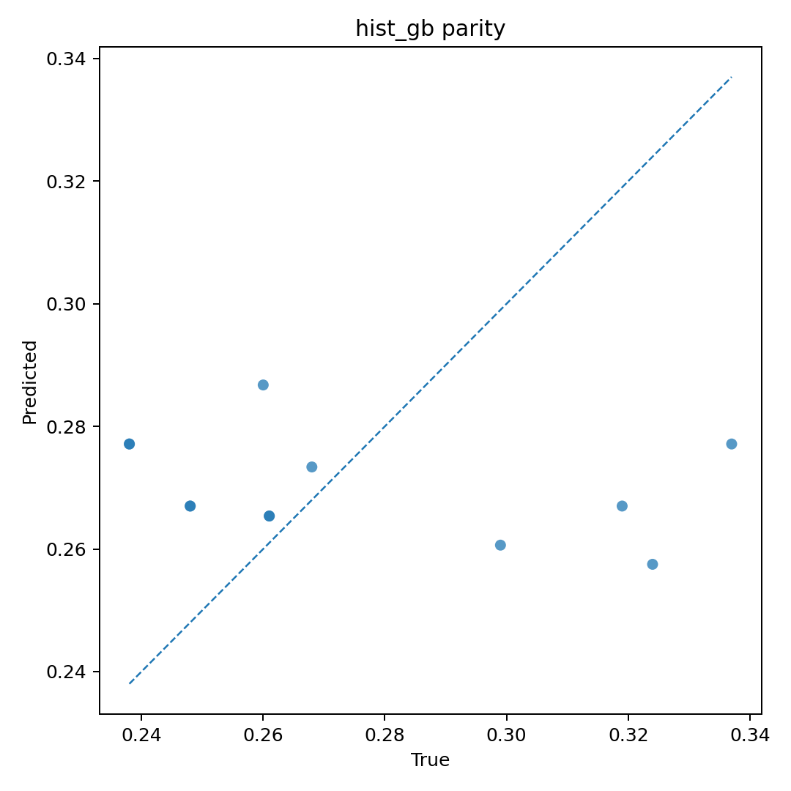

# 2026-05-21 PIM 气体分离项目阶段总结

## 1. 文档定位

这份文档用于汇总当前阶段已经完成的研究全流程、实验过程、实验结果、结果分析、结果讨论与后续展望。

它重点回答五个问题：

1. 当前项目已经真实打通了哪些研究流程
2. 四档表示方式和 FFV 支线分别完成到了什么程度
3. 目前最关键的实验结果是什么
4. 这些结果应当如何解读，而不是只看单个指标
5. 下一阶段最值得继续推进的方向是什么

## 2. 研究全流程

到目前为止，这条流程在工程上已经形成两条可区分的路线：

- 主线：清洗数据 -> 四档表示 -> grouped split -> 下游建模 -> screening
- 支线：外部 FFV 预训练 -> 增强表生成 -> stacked FFV 对比实验

## 3. 数据处理与实验对象

### 3.1 数据清洗结果

当前清洗后的主数据情况如下：

- 清洗总行数：`88`
- `FFV pilot`：`12`
- `CO2 main`：`74`
- `CO2/CH4 pair`：`71`
- `CO2/N2 pair`：`71`

数据处理阶段已经完成的关键工作包括：

- 将原始工作簿整理为可用于建模的 tidy 表
- 标准化核心字段与任务子集
- 保留 `smiles_single` 作为当前主要结构入口
- 引入 family 相关标签列，为后续研究预留结构

### 3.2 当前任务定义

本项目当前的下游任务不是统一的“大而全建模”，而是三个可比较的任务：

1. `CO2 permeability`
2. `CO2/CH4 selectivity`
3. `CO2/N2 selectivity`

它们共同共享：

- 同一份清洗逻辑
- 同一类 grouped split 原则
- 同一套核心评价指标 `MAE / RMSE / R2`

## 4. 实验过程

### 4.1 四档主线实验

主线实验围绕四档表示方式展开：

1. `descriptor_2d`
2. `descriptor_2d_3d`
3. `graph_2d`
4. `graph_3d`

它们分别覆盖：

- 表格描述符主线
- 二维加三维数值特征主线
- 二维图神经网络主线
- 三维图神经网络主线

### 4.2 分组切分原则

这一阶段最重要的方案修正之一，是不再接受简单随机切分作为默认基线，而改为：

- 以膜身份为核心的 grouped split

这样做的目的，是避免同一膜在不同老化条件或测量条件下同时出现在训练集与测试集中，造成性能高估。

### 4.3 FFV 相关实验

FFV 相关部分目前分为三层：

1. 内部小样本 `ffv_pilot`
2. `oracle_ffv` 上界参考
3. 外部大样本 `predffv_2d` 增强路线

此外，项目中还保留了一条重要但暂未并入默认训练主线的物理模拟路线：

4. 基于 [get_FFV/example](C:/Users/16976/Desktop/smile_FFV/get_FFV/example) 的 FFV 直接模拟计算

其中：

- `ffv_pilot` 用于验证内部小样本是否具备独立探索价值
- `oracle_ffv` 用于回答“如果真实 FFV 完美已知，理论上能否帮助下游”
- `predffv_2d` 用于回答“外部大样本预训练得到的 FFV 代理特征，是否能在真实下游任务里形成收益”
- `get_FFV` 模拟路线用于为少量代表性聚合物提供更接近物理真值的 FFV 参考

### 4.4 外部 FFV 预训练与增强表

外部 FFV 路线当前已经完成：

- `graph_2d` 上游 FFV 预训练
- 三张增强表生成
- 12 组 `predffv_2d` 下游实验

增强表包括：

- `co2_main_subset_with_predicted_ffv_2d.csv`
- `co2_ch4_subset_with_predicted_ffv_2d.csv`
- `co2_n2_subset_with_predicted_ffv_2d.csv`

增强表相较原始清洗表新增了 5 列：

- `external_gnn_2d_predicted_ffv`
- `external_gnn_2d_predicted_log10_ffv`
- `external_gnn_2d_prediction_ok`
- `external_gnn_2d_ffv_completed`
- `external_gnn_2d_log10_ffv_completed`

当前确认的工程结论是：

- `prediction_ok` 覆盖率达到 `100%`
- 原始表中的 FFV 缺失值已经全部被 completed 列补齐
- 因此增强表生成流程本身是成功的

## 5. 实验结果

### 5.1 外部 FFV 上游预训练结果

当前 `graph_2d` 外部 FFV 预训练的代表性测试结果为：

| 指标 | 数值 |
|---|---:|
| MAE | 0.0103 |
| RMSE | 0.0153 |
| R2 | 0.8904 |
| best epoch | 10 |

这说明：

- 外部大样本上的 `SMILES -> FFV` 学习本身是成功的
- 当前问题不在于“FFV 模型完全训练失败”
- 而在于“上游成功是否能稳定转化为下游收益”

### 5.2 四档基线最佳结果

| 实验 | 最佳模型 | MAE | RMSE | R2 |
|---|---|---:|---:|---:|
| `co2_grouped_descriptor_2d` | `random_forest` | 0.3466 | 0.4494 | 0.4163 |
| `co2_grouped_descriptor_2d_3d` | `random_forest` | 0.3456 | 0.4481 | 0.4195 |
| `co2_grouped_graph_2d` | `gcn_small` | 0.5126 | 0.6124 | -0.0843 |
| `co2_grouped_graph_3d` | `distance_gnn_small` | 0.4198 | 0.4726 | 0.3542 |
| `co2_ch4_descriptor_2d` | `random_forest` | 0.1494 | 0.2008 | -0.1064 |
| `co2_ch4_descriptor_2d_3d` | `random_forest` | 0.1497 | 0.2018 | -0.1174 |
| `co2_ch4_graph_2d` | `gcn_small` | 0.1400 | 0.1911 | -0.0021 |
| `co2_ch4_graph_3d` | `distance_gnn_small` | 0.1212 | 0.1625 | 0.2749 |
| `co2_n2_descriptor_2d` | `random_forest` | 0.1077 | 0.1716 | 0.1629 |
| `co2_n2_descriptor_2d_3d` | `random_forest` | 0.1097 | 0.1734 | 0.1454 |
| `co2_n2_graph_2d` | `gcn_small` | 0.1288 | 0.1804 | 0.0752 |
| `co2_n2_graph_3d` | `distance_gnn_small` | 0.1196 | 0.1764 | 0.1151 |

### 5.3 `predffv_2d` 增强实验最佳结果

| 实验 | 最佳模型 | MAE | RMSE | R2 |
|---|---|---:|---:|---:|
| `co2_grouped_descriptor_2d__predffv_2d` | `random_forest` | 0.3508 | 0.4526 | 0.4079 |
| `co2_grouped_descriptor_2d_3d__predffv_2d` | `random_forest` | 0.3498 | 0.4527 | 0.4076 |
| `co2_grouped_graph_2d__predffv_2d` | `gcn_small` | 0.4237 | 0.5145 | 0.2346 |
| `co2_grouped_graph_3d__predffv_2d` | `distance_gnn_small` | 0.4141 | 0.4833 | 0.3248 |
| `co2_ch4_descriptor_2d__predffv_2d` | `random_forest` | 0.1513 | 0.2012 | -0.1117 |
| `co2_ch4_descriptor_2d_3d__predffv_2d` | `random_forest` | 0.1502 | 0.2001 | -0.0996 |
| `co2_ch4_graph_2d__predffv_2d` | `gcn_small` | 0.1656 | 0.2190 | -0.3162 |
| `co2_ch4_graph_3d__predffv_2d` | `distance_gnn_small` | 0.1449 | 0.1951 | -0.0449 |
| `co2_n2_descriptor_2d__predffv_2d` | `random_forest` | 0.1104 | 0.1731 | 0.1480 |
| `co2_n2_descriptor_2d_3d__predffv_2d` | `random_forest` | 0.1104 | 0.1731 | 0.1486 |
| `co2_n2_graph_2d__predffv_2d` | `gcn_small` | 0.1621 | 0.2190 | -0.3629 |
| `co2_n2_graph_3d__predffv_2d` | `distance_gnn_medium` | 0.1140 | 0.1716 | 0.1626 |

### 5.4 `oracle_ffv` 参考结果

| 实验 | 最佳模型 | MAE | RMSE | R2 | n |
|---|---|---:|---:|---:|---:|
| `co2_grouped_oracle_ffv` | `random_forest` | 0.3043 | 0.3676 | -0.0786 | 11 |
| `co2_ch4_oracle_ffv` | `hist_gb` | 0.1313 | 0.1778 | -0.2687 | 11 |
| `co2_n2_oracle_ffv` | `ridge` | 0.1007 | 0.1278 | -0.5093 | 8 |

注意：

- `oracle_ffv` 的样本量太小
- 它更适合作为方向性参考，而不是严格数值上界

## 6. 图表与指标解读

### 6.1 代表性图表

| 基线一致性图 | 基线残差图 |
|---|---|
|  |  |

| Robeson 筛选图 | FFV 小样本图 |
|---|---|
|  |  |

### 6.2 指标是什么意思

- `MAE`：平均绝对误差，越小越好
- `RMSE`：均方根误差，越小越好，对大误差样本惩罚更重
- `R2`：决定系数，越接近 `1` 越好；`0` 表示和直接预测均值差不多；`< 0` 表示比只猜均值还差

### 6.3 这三个指标该怎么联合看

- `MAE` 更适合看平均偏差大小
- `RMSE` 更适合看是否存在少数误差特别大的样本
- `R2` 更适合看模型是否真正学到了高低性能的区分规律

因此，不能只因为 `MAE` 不大，就认为模型已经可用；也不能只因为某些任务 `R2` 为负，就断言整个流程毫无意义。

## 7. 实验数据分析

### 7.1 `CO2 grouped`：当前最容易学到规律的主任务

在基线实验中，`CO2 grouped descriptor_2d_3d` 达到：

- `MAE = 0.3456`
- `RMSE = 0.4481`
- `R2 = 0.4195`

这说明：

- 当前模型已经学到一部分结构-性能关系
- 但仍未达到高置信筛选水平
- `RMSE` 仍明显高于 `MAE`，说明存在一些较难预测的膜

对于 `predffv_2d`：

- `descriptor_2d` 和 `descriptor_2d_3d` 均略退步
- `graph_2d` 从 `R2 = -0.0843` 提升到 `0.2346`

结论是：

- `predffv_2d` 对强描述符主线没有形成稳定增益
- 但对部分图模型存在条件性帮助

### 7.2 `CO2/CH4`：当前最困难的下游任务

这个任务最明显的特征是：

- 很多配置的 `R2` 仍为负值

即使模型的 `MAE` 并不夸张，也说明它还没有稳定学会区分真正高选择性与低选择性样本。

更重要的是：

- 基线里最强的是 `graph_3d`，`R2 = 0.2749`
- 加入 `predffv_2d` 后，最强图路线退到了 `R2 = -0.0449`

这意味着：

- `predicted_ffv` 在 `CO2/CH4` 上不但没有普遍帮助，反而可能带来额外噪声

### 7.3 `CO2/N2`：处于中间状态

这个任务的现象更像“有信号，但不够强”：

- 基线最好 `R2 = 0.1629`
- `predffv_2d` 最好 `R2 = 0.1626`

整体看：

- 有一部分配置能够得到轻微正 `R2`
- 说明并非完全不可学
- 但当前还不足以支撑强结论式筛选

### 7.4 上游成功，不等于下游一定受益

这是当前阶段最重要的研究结论之一。

外部 FFV 预训练在上游任务上的 `R2` 约为 `0.89`，说明：

- 上游 `SMILES -> FFV` 的学习是成功的

但把它接入下游以后，整体增益并不稳定，说明：

- 上游代理变量的可预测性
- 不等于
- 它在下游任务中的信息增量一定足够大

### 7.5 外部 FFV 与主数据重叠样本的直接拟合并不强

在内部重叠样本上的对照显示：

- `co2_main` 重叠样本仅 `11` 条
- `log10 FFV` 的 `R2` 约为 `-1.12`

若只看 `aging_days = 0` 的小子集：

- `n = 5`
- 原始 FFV `R2` 约为 `0.053`
- `log10 FFV` `R2` 约为 `0.046`

这说明：

- 外部 FFV 预训练虽然在外部数据分布上表现很好
- 但直接迁移到当前 PIM 主任务数据分布时，仍然存在明显分布差异

## 8. 结果讨论

### 8.1 当前主瓶颈不只是 FFV

如果只看当前结果，一个非常清楚的现象是：

- 无论是否加入 FFV，很多任务的 `R2` 整体都不高

这说明主瓶颈并不只来自 FFV 支线本身，还可能来自：

- 数据规模偏小
- 标签噪声较大
- 实验上下文缺失
- 结构表示与目标之间的信息链仍不完整

### 8.2 `predffv_2d` 更像辅助特征，而不是默认增强模块

目前更准确的说法是：

- `predffv_2d` 对某些图模型路线有帮助
- 对强描述符基线基本没有稳定提升
- 对部分任务甚至会造成退化

因此，现阶段不应把 `predffv_2d` 写成默认主线，而应把它写成：

- 任务依赖的辅助特征研究支线

### 8.3 图模型仍值得继续保留

虽然图模型当前整体还不如最强描述符主线稳定，但它们的意义并没有消失。

原因在于：

- `graph_2d` 在 `CO2 grouped + predffv_2d` 上出现了明显改善
- `graph_3d` 在 `CO2/N2` 上保留了探索价值
- 后续如果 3D 特征或更强上游代理变量更成熟，图路线仍可能体现出更高上限

## 9. 未来展望

下一阶段最值得继续推进的方向包括：

1. 继续以四档表示方式作为主线，对三类任务做更系统的公平比较
2. 完成 `predffv_3d` 路线的可执行验证，形成 `predffv_2d` 与 `predffv_3d` 的正面对照
3. 优先分析在哪些任务和模型上 FFV 真正提供了独立信息，而不是与原始描述符高度重叠
4. 进一步补充更贴近当前 PIM 分布的外部 FFV 数据，降低迁移分布偏差
5. 继续完善 3D 描述符与 3D 图路线，验证空间信息是否能形成稳定增益
6. 在结果分析层面加强对异常样本、边界样本和老化条件样本的专项检查

## 10. 当前阶段最合理的总结表述

当前最适合写入汇报或论文阶段总结的表述是：

> 本阶段项目已经完成了 PIM 气体分离数据清洗、四档结构表示建模、grouped split 评估、Robeson 风格筛选，以及外部 FFV 预训练增强路线的搭建与对比实验。结果表明，外部大样本 FFV 预训练在上游 `SMILES -> FFV` 任务上具有较强预测能力，但其生成的 `predicted_ffv` 特征在下游 `CO2`、`CO2/CH4` 和 `CO2/N2` 任务中的收益具有明显任务依赖性，尚未形成对强基线模型的稳定全局提升。现阶段更合理的研究结论是：FFV 可作为有价值的辅助特征研究支线，但当前主瓶颈仍来自下游任务本身的数据规模、标签噪声与实验信息缺失，后续应继续围绕四档表示方式、3D 路线和更高质量外部数据展开系统对比。

## 11. 相关输出与延伸阅读

建议继续查看：

- `docs/14_experiment_results_summary_20260518.md`
- `docs/15_external_ffv_pretraining.md`
- `docs/18_ffv_simulation_workflow.md`
- `docs/07_outputs_and_interpretation.md`
- `output/experiments/`
- `ffv_pretrain/README_zh.md`
