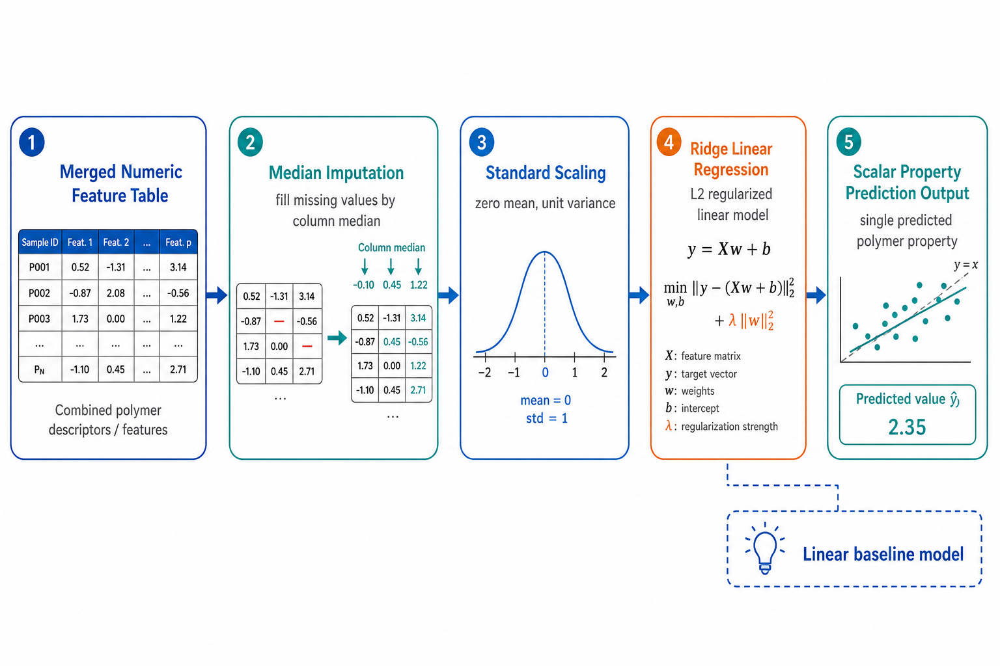
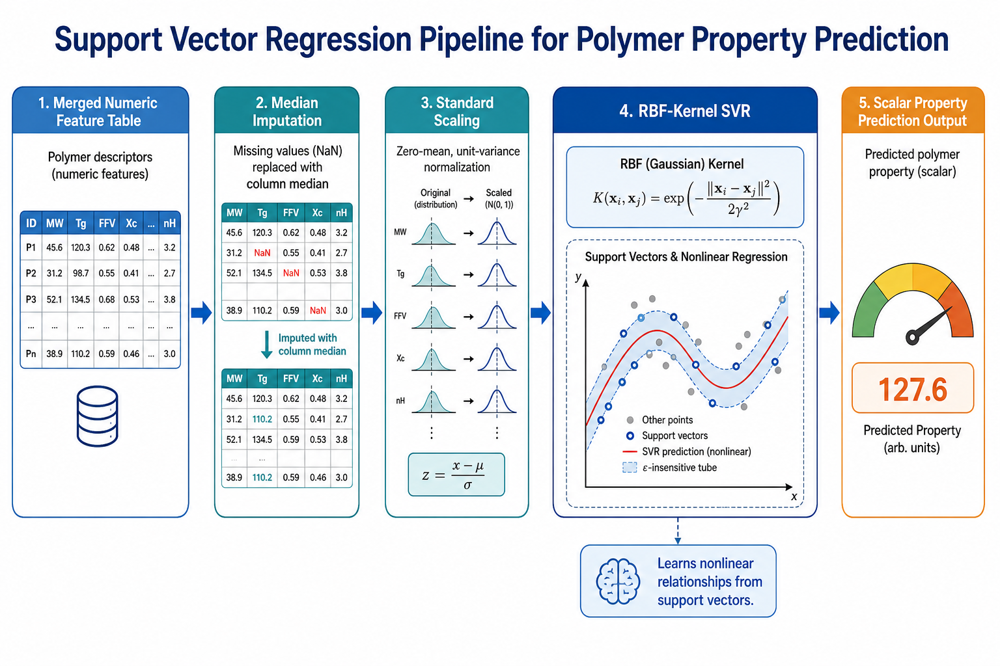
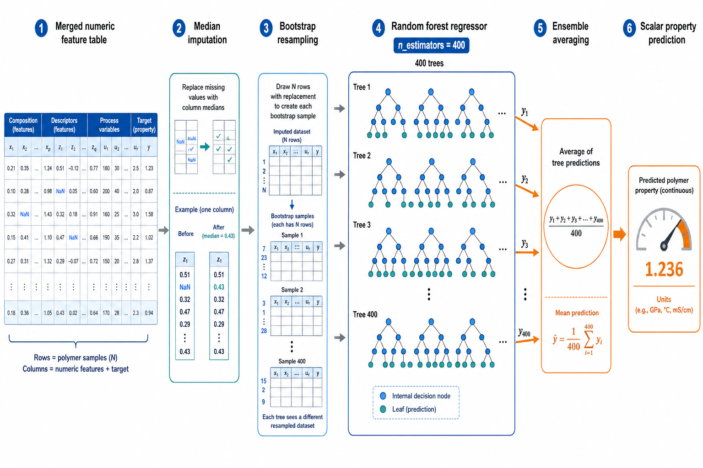
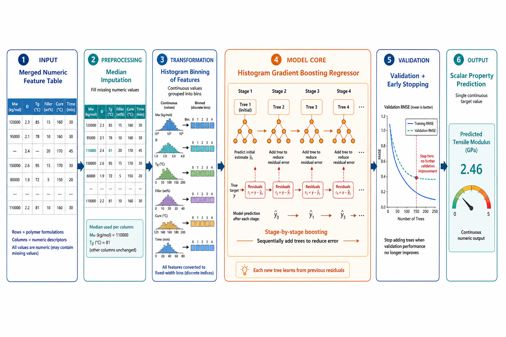
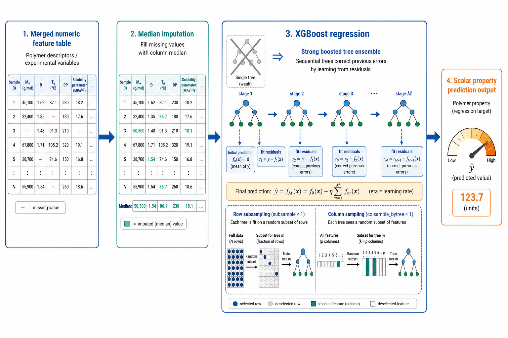
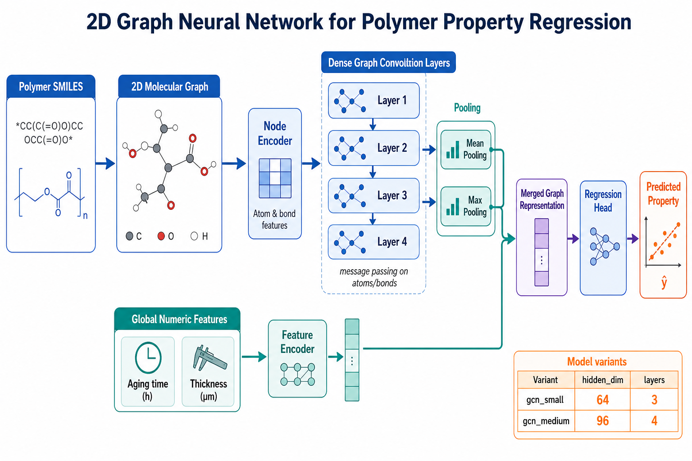
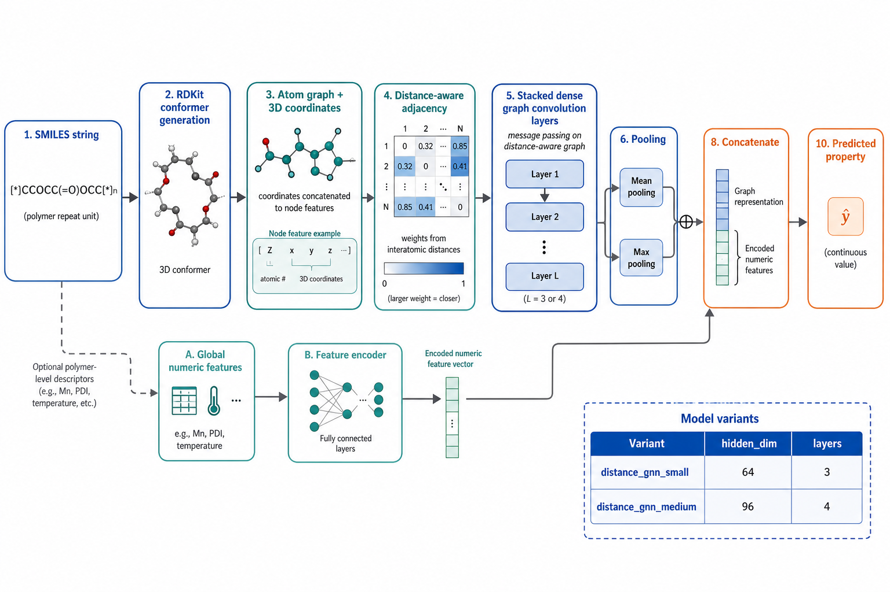
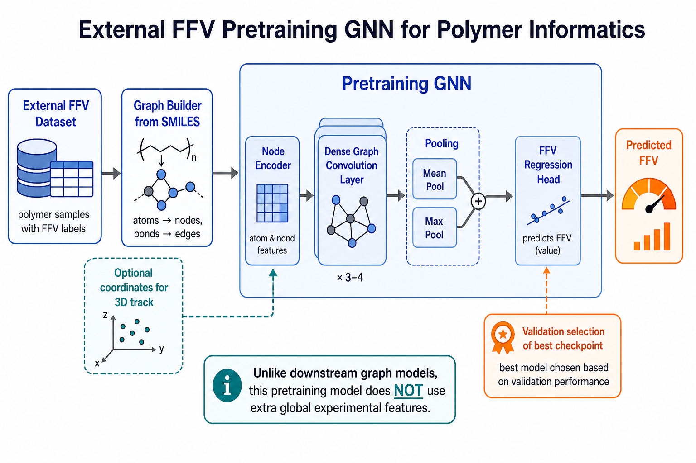

# 训练模型架构图解

这份文档专门用于给非 AI 背景读者解释：当前仓库里训练时真正会跑到哪些模型，它们各自的大致结构是什么，它们之间的区别又在哪里。

这些图都是基于当前真实代码路径整理的讲解图，而不是脱离代码的通用示意图。对应实现主要位于：

- [pim_ml/methods/_table_models.py](C:/Users/16976/Desktop/smile_FFV/pim_ml/methods/_table_models.py)
- [pim_ml/methods/_graph_models.py](C:/Users/16976/Desktop/smile_FFV/pim_ml/methods/_graph_models.py)
- [pim_ml/methods/graph_2d/models.py](C:/Users/16976/Desktop/smile_FFV/pim_ml/methods/graph_2d/models.py)
- [pim_ml/methods/graph_3d/models.py](C:/Users/16976/Desktop/smile_FFV/pim_ml/methods/graph_3d/models.py)
- [ffv_pretrain/ffv_pretrain/model.py](C:/Users/16976/Desktop/smile_FFV/ffv_pretrain/ffv_pretrain/model.py)

## 1. 表格模型家族

这一路模型都建立在“先把聚合物表示成一张数值特征表”这个前提上。  
也就是说，输入不再是图，而是已经提取好的指纹、描述符、aging、thickness、可选 3D 数值列等。

### 1.1 Ridge

怎么理解：

- 先做缺失值中位数填补。
- 再做标准化，让不同量纲的特征处于可比较范围。
- 最后用一个带 L2 正则的线性模型做回归。

适合讲解时的关键词：

- 线性基线模型
- 可解释性相对强
- 对复杂非线性关系表达能力有限

### 1.2 SVR

怎么理解：

- 预处理步骤和 Ridge 类似，仍然是先补缺失、再标准化。
- 真正的预测器换成了 `RBF` 核的支持向量回归。
- 它不是直接画一条直线，而是通过核函数去学习非线性关系。

适合讲解时的关键词：

- 非线性传统机器学习模型
- 对样本量不大时常常有效
- 对参数和特征缩放比较敏感

### 1.3 Random Forest

怎么理解：

- 先做中位数填补。
- 然后做 bootstrap 重采样，生成很多不同训练子集。
- 每个子集各自长出一棵回归树。
- 最终把大量树的预测结果取平均。

适合讲解时的关键词：

- 多棵树投票/平均
- 对非线性关系和特征交互较友好
- 当前项目里它是多组实验中的稳定强基线之一

### 1.4 HistGradientBoosting

怎么理解：

- 先做中位数填补。
- 特征会先被分箱，再用一棵棵提升树按顺序逐步纠正前一轮误差。
- 当前代码里还启用了验证集早停，所以不是盲目一直加树。

适合讲解时的关键词：

- 逐步纠错
- 比随机森林更强调“后一棵树纠正前一棵树的残差”
- 当前实现里带有 early stopping

### 1.5 XGBoost

怎么理解：

- 仍然先做缺失值填补。
- 后端是梯度提升树，但比普通 boosting 更强调工程优化。
- 当前代码里用了子采样和列采样，因此每轮并不是看全部样本和全部特征。

适合讲解时的关键词：

- 强化版提升树
- 工程上常见的高性能表格模型
- 当前环境没有安装 `xgboost` 时会自动跳过

## 2. 2D 图模型家族

这一路模型不再先把分子压成一张表，而是直接把 `SMILES` 变成二维分子图。  
节点是原子，边是化学键，再交给图神经网络做信息传播。

### 2.1 `gcn_small` / `gcn_medium`

怎么理解：

- 先把 `SMILES` 转成 2D 分子图。
- 每个原子先经过 node encoder，得到初始节点表示。
- 再经过多层 dense graph convolution，让相邻原子之间交换信息。
- 之后做 `mean pooling` 和 `max pooling`，把整张图压成一个聚合物向量。
- aging、thickness 等全局数值特征会经过单独的 encoder，再与图表示拼接。
- 最后进入回归头输出一个连续数值。

当前两个变体的真实区别：

- `gcn_small`：`hidden_dim=64`，`num_layers=3`
- `gcn_medium`：`hidden_dim=96`，`num_layers=4`

适合讲解时的关键词：

- 直接在分子图上传播信息
- 保留了“谁和谁相连”的结构关系
- 比表格模型更接近化学结构本身

## 3. 3D 图模型家族

这一路和 2D 图模型的最大不同，在于它不仅看“谁和谁相连”，还显式利用空间坐标和距离信息。

### 3.1 `distance_gnn_small` / `distance_gnn_medium`

怎么理解：

- 先从 `SMILES` 生成 RDKit 构象。
- 把 `x, y, z` 坐标拼接到节点特征中。
- 同时建立带距离权重的邻接关系。
- 再通过多层 dense graph convolution 传播结构和空间信息。
- 最终仍然做 pooling，并与全局数值特征拼接，再进入回归头。

当前两个变体的真实区别：

- `distance_gnn_small`：`hidden_dim=64`，`num_layers=3`
- `distance_gnn_medium`：`hidden_dim=96`，`num_layers=4`

适合讲解时的关键词：

- 在 2D 图基础上进一步引入空间信息
- 适合回答“原子间距离是否有帮助”
- 当前 3D 坐标来自 RDKit 构象，而不是实验实测结构

## 4. FFV 预训练模型

这一路模型用于单独学习：

`SMILES -> FFV`

它不直接预测 CO2 渗透率，而是先在外部 FFV 数据集上学习一个上游表示，再把预测得到的 FFV 回填到主任务。

### 4.1 External FFV pretrain GNN

怎么理解：

- 输入是外部 FFV 数据集中的 `SMILES`。
- 可以走 2D 图轨道，也可以走 3D 图轨道。
- 节点经过 encoder 和多层图卷积之后，做 `mean pool + max pool`。
- 然后直接进入 FFV 回归头，输出预测 FFV。
- 验证阶段选出最佳 checkpoint，再用于生成 `predicted_ffv` 增强表。

它和下游图模型的重要区别：

- 它的目标是 `FFV`，不是 `CO2 permeability` 或 selectivity。
- 它当前没有下游图模型里的额外全局实验特征编码器。
- 它的价值主要在于提供一个可回填的辅助特征。

## 5. 一句话对比

如果要给完全不懂 AI 的人快速讲清楚，可以这样概括：

- `Ridge`：最简单的线性基线。
- `SVR`：传统机器学习里的非线性回归器。
- `Random Forest`：很多树一起投票。
- `HistGB`：一棵一棵树按顺序纠错。
- `XGBoost`：工程化更强的提升树。
- `2D GCN`：直接在二维分子连接关系上传播信息。
- `3D distance GNN`：在二维连接关系之外，再利用三维空间距离。
- `FFV pretrain GNN`：先学 `SMILES -> FFV`，再把预测 FFV 送回主任务。

## 6. 结合本项目该怎么看

在本项目里，最重要的不是“模型名字越复杂越好”，而是看三个层面：

- 它是否和当前数据规模匹配。
- 它是否真正利用了当前表中存在的信息。
- 它是否在 grouped split 下仍然保持有效。

因此，这些架构图的作用主要是：

- 帮助非 AI 背景读者理解每类模型“到底在做什么”。
- 帮助报告和答辩时解释不同路线的差异。
- 帮助后续把实验结果和模型结构对应起来，而不是只看指标表。
