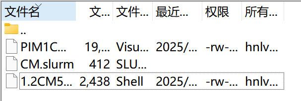
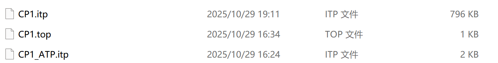
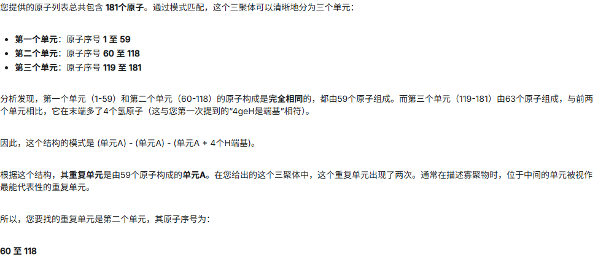
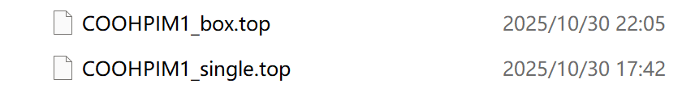
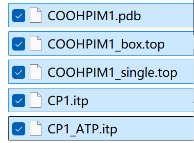
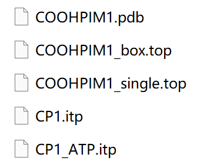
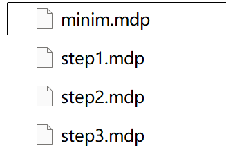
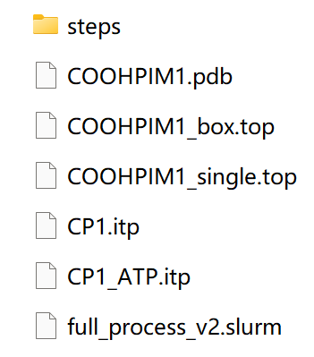

## 电荷分配

###获取一个重复单元的电荷分配

####用一个三聚体来获得中间单元的电荷

#####通过MS建模获得pdb文件

- 三聚体


- 十五聚体

  

#####从Multiwfen中获取`1.2CM5.sh`文件

#####获取slurm文件


```bash
#!/bin/bash

#SBATCH --job-name=test         # 作业名
#SBATCH --partition=cpu         # cpu 队列
#SBATCH -N 1                    # 使用一个节点
#SBATCH -n 80                   # 总核数 80
#SBATCH --ntasks-per-node=80    # 每节点核数 80
#SBATCH --output=%j.out         # 输出日志文件
#SBATCH --error=%j.err          # 错误日志文件

source ~/.bashrc

# 执行 1.2CM5.sh 脚本
./1.2CM5.sh PIM1COOH3poly.pdb 0 1
```

- 注意：

  - 要这里的换行默认为/r/n，要通过notepad++转换为UNIX的/n格式

  - 因为服务器上没有Gaussian，所以需要在个人电脑上对sh进行权限解除（这里我不是很确定，我用了做好的`PIM1COOH3poly.chg`文件)

  - ```bash
    chmod +x ./1.2CM5.sh
    ```

#####将三者放在同一个目录下，并运行slurm文件



```bash
cd ${your_document}
sbatch CM.slurm
//Submitted batch job 1649
squeue -u your_username
//check your job process
```

- 得到chg文件


###获得15聚体的tpo文件

#####用鸿之微云获取tpo、itp等相关文件



#####更改itp中的电荷分布

- 可以用ai快速三聚体中的重复单元定位索引
  - 
- 将中间重复单元的电荷一段一段赋值给15聚体
- 再更改四个H的电荷，实现电荷为0
- 这里有个问题，需要将15聚体pdb文件中的原子名更改为与itp文件相同，且注意要放在13-16列，否则有概率报错


#####将top文件复制一份，分别适用于单链和盒子模型



- 同时需要将`box.top`中的内容更改为：

  ```bash
  ; Created by AuToFF
  ; Most atomtypes are obatined from OPLS-AA/L forcefield and OPLS-AA/L was chosen as the primary forcefield.

  [ defaults ]
  ; nbfunc        comb-rule       gen-pairs       fudgeLJ    fudgeQQ
       1              3              yes            0.5       0.5

  #include "CP1_ATP.itp"
  #include "CP1.itp"

  [ system ]
  BOX

  [ molecules ]
  ; Molecule      nmols
  CP1        10

  ```


> 至此，应该获得，且接下来将会用到的文件为：
>
> 

## 动力学平衡

### slurm文件

这里有一个封装好的slurm文件：


这是一切工作的核心，具体步骤已在注释给出

```bash
#!/bin/bash

#=======================================================================
# SLURM 资源申请 (为GPU优化)
#=======================================================================
#SBATCH --job-name=polymer_md     # 作业名
#SBATCH --partition=gpu           # 正确选择了GPU分区
#SBATCH --nodes=1                 # 使用1个节点
#SBATCH --ntasks=1                # 对于单GPU模拟，通常只启动1个主任务
#SBATCH --cpus-per-task=10        # 为这个任务分配10个CPU核心来辅助GPU，这是一个合理值
#SBATCH --gres=nvidia_geforce_rtx_4090:1              # !!! 关键：明确申请1块GPU卡 !!!
#SBATCH --time=24:00:00           # 为长时间模拟申请足够的时间
#SBATCH --output=%j.out
#SBATCH --error=%j.err

#=======================================================================
# 环境变量和软件加载
#=======================================================================
echo "Job started on $(hostname) at $(date)"
source ~/.bashrc

#=======================================================================
# 变量定义 (更具实际情况设置)
#=======================================================================
POLYMER="COOHPIM1" #15聚体pdb文件前缀，需要修改
OUTPUT_OPTIMIZED_CHAIN="${POLYMER}_optimized" #对单链进行NPT，使其卷曲，输出pdb文件的前缀
SINGLE_CHAIN_TOP="${POLYMER}_single.top" #单链top文件命名
BOX_TOP="${POLYMER}_box.top" #10条链盒子top文件名
OUTPUT_BOX="10_chains_box" 
N_CHAINS=9 # N-1 = 9, so total chains will be 1 (from editconf) + 9 = 10
BOX_SIZE=15.0 # nm ,这是一个关键，很容易因为盒子太小导致报错，不妨设的大一点，不会影响最终的结果

#=======================================================================
# 步骤 1: 盒子构建 (预处理)
#=======================================================================
echo "Step 1: Box Building"

# --- 1.1 优化单链构象 (使用独立的输出文件前缀) ---
echo "Step 1.1: Optimizing the single polymer chain..."
gmx editconf -f ${POLYMER}.pdb -o single_box.gro -bt cubic -c -d 0.5
gmx grompp -f steps/minim.mdp -c single_box.gro -p ${SINGLE_CHAIN_TOP} -o em_single.tpr -maxwarn 5
gmx mdrun -v -deffnm em_single

# NOTE: Assuming steps/step3.mdp is for a short NPT run for the single chain
gmx grompp -f steps/step3.mdp -c em_single.gro -p ${SINGLE_CHAIN_TOP} -o npt_single.tpr -maxwarn 5
gmx mdrun -v -deffnm npt_single

gmx editconf -f npt_single.gro -o ${OUTPUT_OPTIMIZED_CHAIN}.pdb
echo "Optimized single chain saved to ${OUTPUT_OPTIMIZED_CHAIN}.pdb"

# --- 1.2 将优化后的链插入盒子 ---
echo "Step 1.2: Inserting ${N_CHAINS} optimized chains into the box..."
gmx editconf -f ${OUTPUT_OPTIMIZED_CHAIN}.pdb -o ${OUTPUT_BOX}_base.gro -c -box ${BOX_SIZE} ${BOX_SIZE} ${BOX_SIZE}
gmx insert-molecules -f ${OUTPUT_BOX}_base.gro -ci ${OUTPUT_OPTIMIZED_CHAIN}.pdb -nmol ${N_CHAINS} -o ${OUTPUT_BOX}.gro -try 200

#=======================================================================
# 步骤 2: 21步体系平衡 (MD模拟核心)
#=======================================================================
echo "Step 2: Starting the 21-step dynamic balance protocol"

# --- 2.1 能量最小化 (在CPU上运行) ---
echo "Step 2.1: Minimizing the 10-chain box..."
gmx grompp -f steps/minim.mdp -c ${OUTPUT_BOX}.gro -p ${BOX_TOP} -o equil_step0.tpr -maxwarn 5
gmx mdrun -v -deffnm equil_step0
echo "Energy minimization complete. Starting MD steps..."

# --- 2.2 依次执行21个平衡步骤 ---
# 每一步都以上一步的输出(.gro)为输入，生成新的输出，避免文件覆盖
# 所有这些MD步骤都在GPU上运行

gmx grompp -f steps/step1.mdp -c equil_step0.gro -p ${BOX_TOP} -o equil_step1.tpr -maxwarn 5
gmx mdrun -v -deffnm equil_step1 -nb gpu -pme gpu -bonded gpu -update gpu

gmx grompp -f steps/step2.mdp -c equil_step1.gro -p ${BOX_TOP} -o equil_step2.tpr -maxwarn 5
gmx mdrun -v -deffnm equil_step2 -nb gpu -pme gpu -bonded gpu -update gpu

gmx grompp -f steps/step3.mdp -c equil_step2.gro -p ${BOX_TOP} -o equil_step3.tpr -maxwarn 5
gmx mdrun -v -deffnm equil_step3 -nb gpu -pme gpu -bonded gpu -update gpu

gmx grompp -f steps/step4.mdp -c equil_step3.gro -p ${BOX_TOP} -o equil_step4.tpr -maxwarn 5
gmx mdrun -v -deffnm equil_step4 -nb gpu -pme gpu -bonded gpu -update gpu

gmx grompp -f steps/step5.mdp -c equil_step4.gro -p ${BOX_TOP} -o equil_step5.tpr -maxwarn 5
gmx mdrun -v -deffnm equil_step5 -nb gpu -pme gpu -bonded gpu -update gpu

gmx grompp -f steps/step6.mdp -c equil_step5.gro -p ${BOX_TOP} -o equil_step6.tpr -maxwarn 5
gmx mdrun -v -deffnm equil_step6 -nb gpu -pme gpu -bonded gpu -update gpu

gmx grompp -f steps/step7.mdp -c equil_step6.gro -p ${BOX_TOP} -o equil_step7.tpr -maxwarn 5
gmx mdrun -v -deffnm equil_step7 -nb gpu -pme gpu -bonded gpu -update gpu

gmx grompp -f steps/step8.mdp -c equil_step7.gro -p ${BOX_TOP} -o equil_step8.tpr -maxwarn 5
gmx mdrun -v -deffnm equil_step8 -nb gpu -pme gpu -bonded gpu -update gpu

gmx grompp -f steps/step9.mdp -c equil_step8.gro -p ${BOX_TOP} -o equil_step9.tpr -maxwarn 5
gmx mdrun -v -deffnm equil_step9 -nb gpu -pme gpu -bonded gpu -update gpu

gmx grompp -f steps/step10.mdp -c equil_step9.gro -p ${BOX_TOP} -o equil_step10.tpr -maxwarn 5
gmx mdrun -v -deffnm equil_step10 -nb gpu -pme gpu -bonded gpu -update gpu

gmx grompp -f steps/step11.mdp -c equil_step10.gro -p ${BOX_TOP} -o equil_step11.tpr -maxwarn 5
gmx mdrun -v -deffnm equil_step11 -nb gpu -pme gpu -bonded gpu -update gpu

gmx grompp -f steps/step12.mdp -c equil_step11.gro -p ${BOX_TOP} -o equil_step12.tpr -maxwarn 5
gmx mdrun -v -deffnm equil_step12 -nb gpu -pme gpu -bonded gpu -update gpu

gmx grompp -f steps/step13.mdp -c equil_step12.gro -p ${BOX_TOP} -o equil_step13.tpr -maxwarn 5
gmx mdrun -v -deffnm equil_step13 -nb gpu -pme gpu -bonded gpu -update gpu

gmx grompp -f steps/step14.mdp -c equil_step13.gro -p ${BOX_TOP} -o equil_step14.tpr -maxwarn 5
gmx mdrun -v -deffnm equil_step14 -nb gpu -pme gpu -bonded gpu -update gpu

gmx grompp -f steps/step15.mdp -c equil_step14.gro -p ${BOX_TOP} -o equil_step15.tpr -maxwarn 5
gmx mdrun -v -deffnm equil_step15 -nb gpu -pme gpu -bonded gpu -update gpu

gmx grompp -f steps/step16.mdp -c equil_step15.gro -p ${BOX_TOP} -o equil_step16.tpr -maxwarn 5
gmx mdrun -v -deffnm equil_step16 -nb gpu -pme gpu -bonded gpu -update gpu

gmx grompp -f steps/step17.mdp -c equil_step16.gro -p ${BOX_TOP} -o equil_step17.tpr -maxwarn 5
gmx mdrun -v -deffnm equil_step17 -nb gpu -pme gpu -bonded gpu -update gpu

gmx grompp -f steps/step18.mdp -c equil_step17.gro -p ${BOX_TOP} -o equil_step18.tpr -maxwarn 5
gmx mdrun -v -deffnm equil_step18 -nb gpu -pme gpu -bonded gpu -update gpu

gmx grompp -f steps/step19.mdp -c equil_step18.gro -p ${BOX_TOP} -o equil_step19.tpr -maxwarn 5
gmx mdrun -v -deffnm equil_step19 -nb gpu -pme gpu -bonded gpu -update gpu

gmx grompp -f steps/step20.mdp -c equil_step19.gro -p ${BOX_TOP} -o equil_step20.tpr -maxwarn 5
gmx mdrun -v -deffnm equil_step20 -nb gpu -pme gpu -bonded gpu -update gpu

gmx grompp -f steps/step21.mdp -c equil_step20.gro -p ${BOX_TOP} -o equil_step21.tpr -maxwarn 5
gmx mdrun -v -deffnm equil_step21 -nb gpu -pme gpu -bonded gpu -update gpu

# --- 2.3 最终输出 ---
# The final structure is the output of the last step, equil_step21.gro
gmx editconf -f equil_step21.gro -o ${POLYMER}_finished.pdb
echo "Job finished at $(date). Final structure saved to ${POLYMER}_finished.pdb"
```

- 这里需要根据实际情况更改变量名，这也导致了创建文件名时需要遵循一定规则

- 对应具体代码

  ```bash
  # 变量定义 (更具实际情况设置)
  #=======================================================================
  POLYMER="COOHPIM1" #15聚体pdb文件前缀，需要修改
  OUTPUT_OPTIMIZED_CHAIN="${POLYMER}_optimized" #对单链进行NPT，使其卷曲，输出pdb文件的前缀
  SINGLE_CHAIN_TOP="${POLYMER}_single.top" #单链top文件命名
  BOX_TOP="${POLYMER}_box.top" #10条链盒子top文件名
  OUTPUT_BOX="10_chains_box" 
  N_CHAINS=9 # N-1 = 9, so total chains will be 1 (from editconf) + 9 = 10
  BOX_SIZE=15.0 # nm ,这是一个关键，很容易因为盒子太小导致报错，不妨设的大一点，不会影响最终的结果

  ```


- 对应文件名：

  

### 21steps文件

- 对应slurm代码

```bash
# --- 2.2 依次执行21个平衡步骤 ---
# 每一步都以上一步的输出(.gro)为输入，生成新的输出，避免文件覆盖
# 所有这些MD步骤都在GPU上运行

gmx grompp -f steps/step1.mdp -c equil_step0.gro -p ${BOX_TOP} -o equil_step1.tpr -maxwarn 5
gmx mdrun -v -deffnm equil_step1 -nb gpu -pme gpu -bonded gpu -update gpu

gmx grompp -f steps/step2.mdp -c equil_step1.gro -p ${BOX_TOP} -o equil_step2.tpr -maxwarn 5
gmx mdrun -v -deffnm equil_step2 -nb gpu -pme gpu -bonded gpu -update gpu

gmx grompp -f steps/step3.mdp -c equil_step2.gro -p ${BOX_TOP} -o equil_step3.tpr -maxwarn 5
gmx mdrun -v -deffnm equil_step3 -nb gpu -pme gpu -bonded gpu -update gpu

gmx grompp -f steps/step4.mdp -c equil_step3.gro -p ${BOX_TOP} -o equil_step4.tpr -maxwarn 5
gmx mdrun -v -deffnm equil_step4 -nb gpu -pme gpu -bonded gpu -update gpu

gmx grompp -f steps/step5.mdp -c equil_step4.gro -p ${BOX_TOP} -o equil_step5.tpr -maxwarn 5
gmx mdrun -v -deffnm equil_step5 -nb gpu -pme gpu -bonded gpu -update gpu

gmx grompp -f steps/step6.mdp -c equil_step5.gro -p ${BOX_TOP} -o equil_step6.tpr -maxwarn 5
gmx mdrun -v -deffnm equil_step6 -nb gpu -pme gpu -bonded gpu -update gpu

gmx grompp -f steps/step7.mdp -c equil_step6.gro -p ${BOX_TOP} -o equil_step7.tpr -maxwarn 5
gmx mdrun -v -deffnm equil_step7 -nb gpu -pme gpu -bonded gpu -update gpu

gmx grompp -f steps/step8.mdp -c equil_step7.gro -p ${BOX_TOP} -o equil_step8.tpr -maxwarn 5
gmx mdrun -v -deffnm equil_step8 -nb gpu -pme gpu -bonded gpu -update gpu

gmx grompp -f steps/step9.mdp -c equil_step8.gro -p ${BOX_TOP} -o equil_step9.tpr -maxwarn 5
gmx mdrun -v -deffnm equil_step9 -nb gpu -pme gpu -bonded gpu -update gpu

gmx grompp -f steps/step10.mdp -c equil_step9.gro -p ${BOX_TOP} -o equil_step10.tpr -maxwarn 5
gmx mdrun -v -deffnm equil_step10 -nb gpu -pme gpu -bonded gpu -update gpu

gmx grompp -f steps/step11.mdp -c equil_step10.gro -p ${BOX_TOP} -o equil_step11.tpr -maxwarn 5
gmx mdrun -v -deffnm equil_step11 -nb gpu -pme gpu -bonded gpu -update gpu

gmx grompp -f steps/step12.mdp -c equil_step11.gro -p ${BOX_TOP} -o equil_step12.tpr -maxwarn 5
gmx mdrun -v -deffnm equil_step12 -nb gpu -pme gpu -bonded gpu -update gpu

gmx grompp -f steps/step13.mdp -c equil_step12.gro -p ${BOX_TOP} -o equil_step13.tpr -maxwarn 5
gmx mdrun -v -deffnm equil_step13 -nb gpu -pme gpu -bonded gpu -update gpu

gmx grompp -f steps/step14.mdp -c equil_step13.gro -p ${BOX_TOP} -o equil_step14.tpr -maxwarn 5
gmx mdrun -v -deffnm equil_step14 -nb gpu -pme gpu -bonded gpu -update gpu

gmx grompp -f steps/step15.mdp -c equil_step14.gro -p ${BOX_TOP} -o equil_step15.tpr -maxwarn 5
gmx mdrun -v -deffnm equil_step15 -nb gpu -pme gpu -bonded gpu -update gpu

gmx grompp -f steps/step16.mdp -c equil_step15.gro -p ${BOX_TOP} -o equil_step16.tpr -maxwarn 5
gmx mdrun -v -deffnm equil_step16 -nb gpu -pme gpu -bonded gpu -update gpu

gmx grompp -f steps/step17.mdp -c equil_step16.gro -p ${BOX_TOP} -o equil_step17.tpr -maxwarn 5
gmx mdrun -v -deffnm equil_step17 -nb gpu -pme gpu -bonded gpu -update gpu

gmx grompp -f steps/step18.mdp -c equil_step17.gro -p ${BOX_TOP} -o equil_step18.tpr -maxwarn 5
gmx mdrun -v -deffnm equil_step18 -nb gpu -pme gpu -bonded gpu -update gpu

gmx grompp -f steps/step19.mdp -c equil_step18.gro -p ${BOX_TOP} -o equil_step19.tpr -maxwarn 5
gmx mdrun -v -deffnm equil_step19 -nb gpu -pme gpu -bonded gpu -update gpu

gmx grompp -f steps/step20.mdp -c equil_step19.gro -p ${BOX_TOP} -o equil_step20.tpr -maxwarn 5
gmx mdrun -v -deffnm equil_step20 -nb gpu -pme gpu -bonded gpu -update gpu

gmx grompp -f steps/step21.mdp -c equil_step20.gro -p ${BOX_TOP} -o equil_step21.tpr -maxwarn 5
gmx mdrun -v -deffnm equil_step21 -nb gpu -pme gpu -bonded gpu -update gpu
```

> 为了使文件结构更清晰，我将能量最小化与动力学平衡单独放在了`21steps`文件夹中，所以注意这里调用的应该是`steps/step${n}.mdp`
>
> 
>
> 

> 至此，所有的文件都已备齐
>
> 

### gromacs计算

#### 动力学平衡

```bash
sbatch full_process_v2.slurm
// 大概40min
```

#### 计算盒子体积

```bash
gmx energy -f equil_step21.edr -o volume.xvg
//选Volume，输入22，两次回车
22
```

#### 通过MS计算占据体积

探针考虑CO2，1.65A

## 计算FFV


